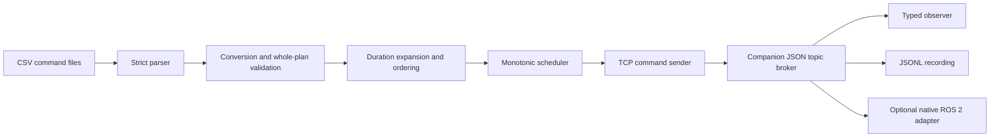

# CSV-to-TCP system architecture



## Execution path

`CSVCommandParser.parse()` checks columns, CSV syntax, JSON syntax and schedule
fields, preserving source locations. `prepare_commands()` checks command-specific
parameters and their corresponding broker message schemas. It resolves default
topics, converts yaw into a quaternion, sorts the timeline and inserts appropriate
duration stops. No network connection is required for either step.

`CommandScheduler` uses `time.monotonic()` for elapsed time. Each deadline is
`timestamp / speed`, independent of wall-clock changes. A Condition lets pause,
resume and stop wake the scheduler without a busy loop. Paused wall time is
subtracted from elapsed time. A callback error is captured in `.error` and stops
further dispatch. The CLI uses `wait(timeout)` to remain responsive to signals.

`TCPCommandSender` wraps the companion `TCPROSClient`. It reports success only after
that client receives the broker's acceptance acknowledgement. The sender does not
retry an uncertain publication. The final JSON summary counts acknowledgements,
not robot movements. Topic schemas and message classes come from the companion
package rather than duplicated definitions.

## APIs

```python
from csv_ros_tcp_processor.csv_parser import CSVCommandParser
from csv_ros_tcp_processor.command_converter import prepare_commands
from csv_ros_tcp_processor.command_scheduler import CommandScheduler
from csv_ros_tcp_processor.tcp_command_sender import TCPCommandSender

plan = prepare_commands(CSVCommandParser('examples/basic_movement.csv').parse())
sender = TCPCommandSender().connect()
scheduler = CommandScheduler(plan, speed=1.0)
scheduler.on_command = lambda cmd: sender.send(cmd['topic'], cmd['message'])
try:
    scheduler.start()
    scheduler.wait()
    if scheduler.error:
        raise scheduler.error
finally:
    scheduler.stop()
    sender.disconnect()
```

The scheduler also exposes `pause()`, `resume()` and `get_status()`. Use `--dry-run`
for a CLI preview. An application can run the scheduler on a background thread
while its UI invokes these controls; callbacks should complete promptly.

## Repository boundaries

`csv_ros_tcp_processor/` contains application-specific parsing and playback.
`tcp_ros_program/` in the companion repository contains wire messages, framing,
routing, recording and ROS conversion. Packaging installs the documented module
names regardless of the GitHub checkout directory. `tests/` covers both isolated
behavior and the combined application.
